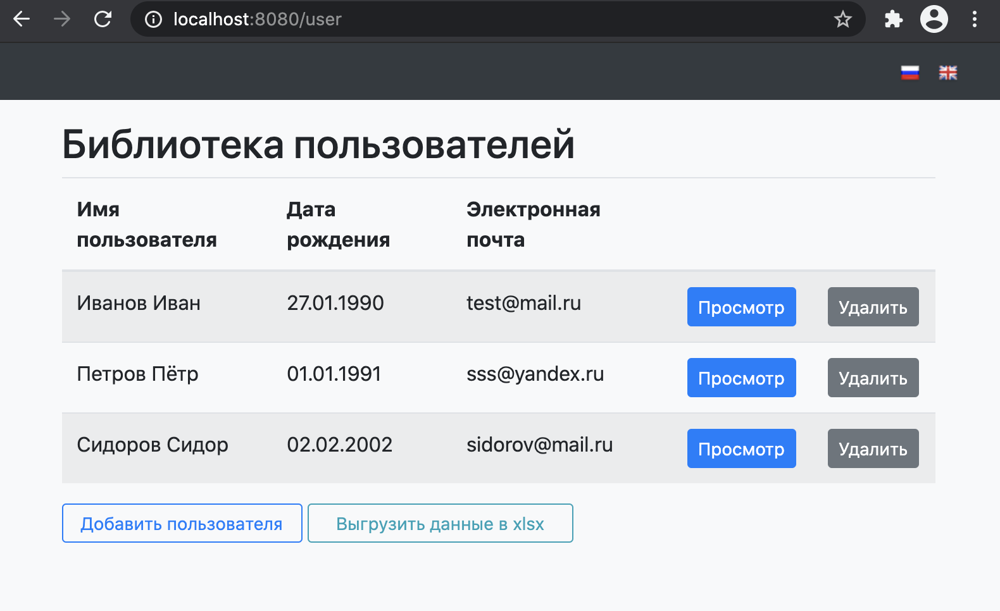

Простое CRUD-приложение на java.

- Backend: spring-boot, h2database, log4j2, lombok, org.apache.poi (для работы с xls)
- Frontend: thymeleaf, bootstrap
- Сборка проекта - maven

Подробное описание первого запуска проекта: first_start.md