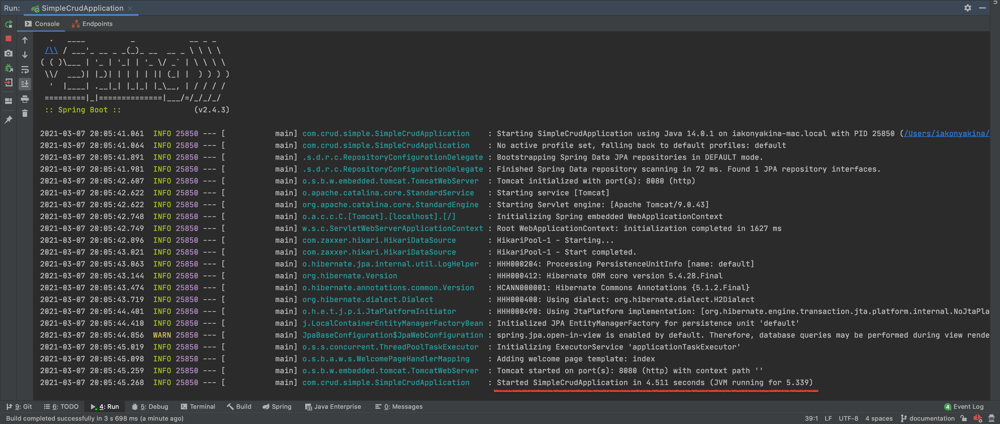

Скачать среду разработки Intellij IDEA можно **[по ссылке](https://www.jetbrains.com/ru-ru/idea/download/#section=mac)**.

Скопируйте ссылку на проект, чтобы клонировать его с github

В Intellij IDEA выберите в меню File > New > Project from version control.
Вставьте скопированную ссылку в поле URL и нажмите 'Clone'

В открывшемся проекте найдите файл pom.xml, лежащий в корне. Нажмите правой кнопкой мыши и выберите 'Add as Maven project'

Запуск проекта производится запуском метода main из файла simple-crud/src/main/java/com/crud/simple/SimpleCrudApplication.java

Консоль в случае успешного запуска:

После чего можно переходить в браузер. Приложение будет доступно по ссылке: http://localhost:8080/

